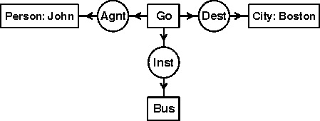
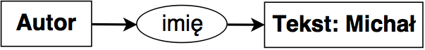
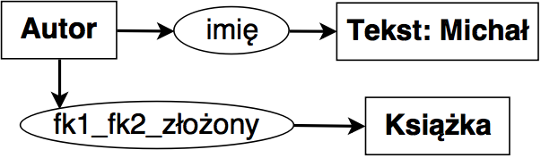
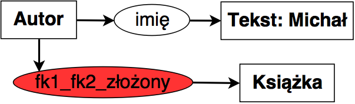
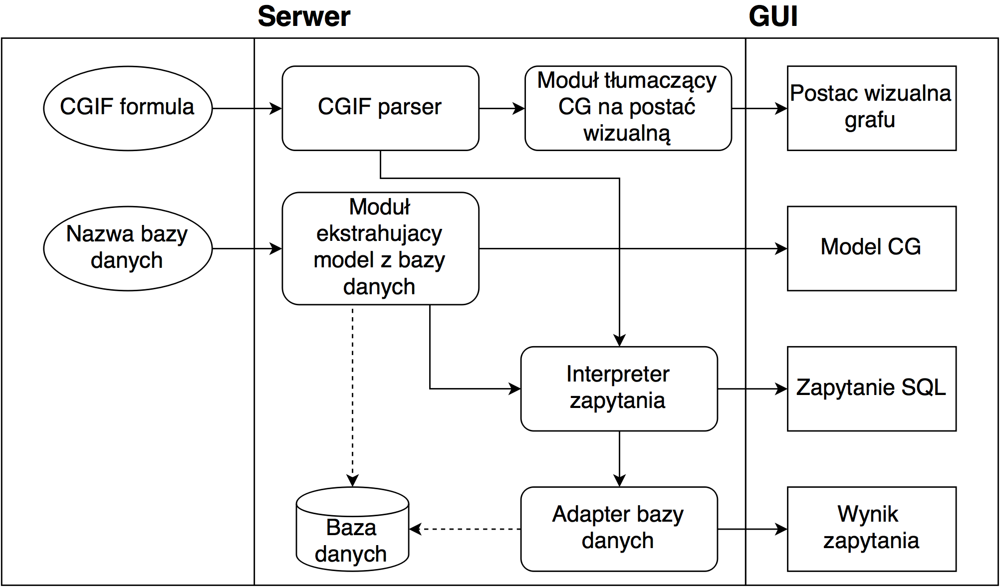

- title : Implementacja systemu służącego do zadawania zapytań w postaci grafów pojęć
- description : Introduction to FsReveal
- author : Michał Kijowski
- theme : black
- transition : default

***

### Implementacja systemu służącego do zadawania zapytań w postaci grafów pojęć

***

### Motywacja

---
Głównym celem mojej pracy magisterskiej jest utworzenie programu umożliwiającego zadawanie zapytań do relacyjnych baz danych w postaci grafów konceptualnych.

---
W ramach pracy sformułowałem dwa główne zagadnienia badawcze:

* 
Modelowanie wiedzy zawartej w relacyjnej bazie danych przy pomocy grafów konceptualnych

* 
Zadawanie zapytań do relacyjnej bazy danych przy użyciu tak powstałego modelu konceptualnego

***

### Grafy konceptualne
' Wprowadzając pojęcie grafu konceptualnego dobrze jest posłużyć się przykładem

---

Klasyczny przykład grafu konceptualnego reprezentujący wiedzę zawartą w zdaniu _John is going to Boston by bus_.
' Graf konceptualny w postaci wizualnej (_Display form_)

---

#### Podstawowe fakty dotyczące grafów konceptualnych
- 
Modelowanie wiedzy o świecie

- 
Obserwacja świata oparta na dostrzeganiu faktów dotyczących istnienia obiektów

' Dokonując empirycznych obserwacji świata praktycznie niemożliwe jest dostrzeżenie faktów mówiących o nieistnieniu, alternatywie lub stwierdzeniu, iż coś zachodzi we wszystkich przypadkach. Wynika z tego cecha grafów mówiąca o tym, że u ich podstawy stoją kwantyfikator egzystencjalny oraz operator koniunkcji.

---
#### Konstrukcja grafu konceptualnego
Graf konceptualny składa się z wierzchołków dwóch rodzajów:

* 
**Konceptów**, czyli  wierzchołków opisujących byty

* 
**Relacji**, czyli wierzchołków opisujących zależności pomiędzy bytami

---
Każda relacja jest połączona krawędziami skierowanymi z wierzchołkami konceptualnymi wchodzącymi w skład danej relacji.

Koncepty oraz relacje nazywane są wspólnie pojęciami.

' Z technicznego punktu widzenia CG jest grafem dwudzielnym skierowanym

---

Analizując graf konceptualny przedstawiony na rysunku możemy powiedzieć, że składa się on z następujących elementów

---

Prostokątnych wierzchołków opisujących koncepty:

* 
konkretny byt typu Osoba (ang. Person) o identyfikatorze John

* 
konkretny byt typu Miasto (ang. City) o identyfikatorze Boston

* 
niesprecyzowany byt typu Autobus (ang. Bus)

* 
niesprecyzowany byt typu Iść (ang. Go)

---

Owalnych wierzchołków opisujących relacje pomiędzy powyższymi bytami:

* 
relacja mówiąca o tym, że John jest Wykonawcą (ang. Agent) konceptu Iść

* 
relacja mówiąca o tym, że Autobus jest Narzędziem (ang. Instrument) konceptu Iść

* 
relacja mówiąca o tym, że Boston jest Celem (ang. Destination) konceptu Iść

---
#### Formy zapisu
Przydatną cechą grafów konceptualnych jest mnogość sposobów ich zapisu.

_Postać graficzna_ jest formatem najbardziej przyjaznym dla czytelnika. Jednakże, istnieje również kilka zapisów liniowych, które są dużo przyjaźniejsze dla programów komputerowych pracujących z grafami.

---
### CGIF

---

Formatem najczęsciej używanym do komunikacji pomiędzy programami wykorzystującymi grafy konceptualne jest format o nazwie **Conceptual Graph Interchange Format**.

W ramach projektu Common Logic zostały zdefiniowane w standardzie ISO dwie odmiany formatu CGIF:

* 
**format podstawowy**(ang. _core syntax_)

* 
**format rozszerzony**(ang. _extended syntax_)

Obie formy są sobie równoważne - format rozszerzony został wprowadzony wyłącznie w celu uproszczenia zapisu

' W ramach formatu CGIF koncepty ujętę są w nawiasy kwadratowe, natomiast relacje - zwykłe nawiasy. Symbole postaci \*x nazywane są etykietami definiującymi, natomiast symbole postaci ?y - etykietami związanymi. Dzięki temu możliwa jest łatwa prezentacja krawędzi grafu.

---

    Core CGIF:
    [*x] [*y]
    (Go ?x) (Person John) (City Boston) (Bus ?y)
    (Agnt ?x John) (Dest ?x Boston) (Inst ?x ?y)

    Extended CGIF:
    [Go: *x] [Person: John *y] [City: Boston *z] [Bus: *w]
    (Agnt ?x ?y) (Dest ?x ?z) (Inst ?x ?z)

---

---
### CLIF

---

Kolejnym z liniowych sposobów zapisu jest **Common Logic Interchange Form**, który został zdefiniowany w ramach tego samego projektu co CGIF.

---
    (exists ((?x Go) (?y Person) (?z City) (?w Bus))
            (and (Name ?y John) (Name ?z Boston)
                 (Agnt ?x ?y) (Dest ?x ?z) (Inst ?x ?w)))
---

### Formuła logiczna

---

Ważną cechą wszystkich grafów konceptualnych jest ich mocne zakorzenienie w logice predykatów, dzięki czemu graf możemy zapisać w postaci formuły logicznej

---

$ (((\exists\) x:Go)(\(\exists\) y:Person)((\(\exists\) z:City)((\(\exists\) w:Bus)
   (name(y,'John') \(\wedge\) name(z,'Boston') \(\wedge\)
      agnt(x,y) \(\wedge\) dest(x,z) \(\wedge\) inst(x,w)) $

***

### Model grafu konceptualnego

W celu precyzyjnej definicji składni oraz semantyki grafu konceptualnego wprowadza się pojęcie **modelu** (zwanego czasami **słownikiem** lub **wsparciem**), który pozwala opisać syntaktyczne ograniczenia występujące pomiędzy pojęciami oraz dostarcza informacji na temat dziedziny, którą opisuje rozpatrywany graf.

---

Modelem nazywamy krotkę postaci $ M = ((T_C, \le_C), (T_R, \le_R), I) $ gdzie:

* zbiór $T_C$ nazywamy zbiorem typów konceptów, natomiast relację $\le_C$ - hierarchią konceptów.
* zbiór $T_R$ nazywamy zbiorem typów relacji, natomiast relację $\le_R$ - hierarchią relacji.
* zbiór $I$ nazywamy zbiorem indywiduów.

---
Hierarchią nad zbiorem typów konceptów $T_C$ nazywamy relację częsciowego porządku $\le_C$ o następujących własnościach

---

Jeśli dla $x,y \in T_C$ zachodzi $x \le_C y$ to wówczas mówimy, że $x$ jest podtypem $y$, natomiast $y$ jest nadtypem x. Dodatkowo jeśli $x \neq_C y$ to mówimy o podtypie właściwym oraz nadtypie właściwym

---

W zbiorze $T_C$ istnieją dwa obiekty wyróżnione:

* obiekt $\top $ będący elementem maksymalnym porządku $\le_C$ -  oznacza to, że wszystkie koncepty należące do $T_C$ są podtypem konceptu $\top$. Element $\top$ nazywamy typem uniwersalnym.
* obiekt $\bot $ będący elementem minimalnym porządku $\le_C$ - oznacza to, że wszystkie koncepty należące do $T_C$ są nadtypem konceptu $\bot$. Element $\bot$ nazywamy typem absurdalnym.

' Należy podkreślić, że w ramach relacji częściowego porządku na typach konceptów nie definiujemy relacji równoważności pomiędzy konceptami.
' Zbiór typów konceptów wraz z hierarchią $(T_C, \le_C)$ jest kratą.

---

Hierarchia nad zbiorem typów konceptów $T_R = (T_R^1, \ldots , T_R^n)$, gdzie $T_R^k$ jest podzbiorem typów relacji o arności równej $k$, nazywamy relację częściowego porządku $\le_R$ o następujących własnościach

---

Jeśli $x \in T_R^n$, $y \in T_R^m$ oraz $n\neq m$ to wówczas $x$ oraz $y$ są nieporównywalne.

---

Jeśli dla $x,y \in T_R^k$ zachodzi $x \le_R y$ to wówczas mówimy, że $x$ jest podtypem $y$, natomiast $y$ jest nadtypem x. Dodatkowo jeśli $x \neq_R y$ to mówimy o podtypie właściwym oraz nadtypie właściwym

---

Dla każdego ze zbiorów $T_R^k$, gdzie $k=1,\ldots , n$ istnieją dwa obiekty wyróżnione:

* obiekt $\top_k $ będący elementem maksymalnym porządku $\le_C$ ograniczonego do podzbioru $T_R^k$ - oznacza to, że wszystkie koncepty należące do $T_R^k$ są podtypem konceptu $\top_k$. Element $\top_k$ nazywamy typem uniwersalnym o arności k.
* obiekt $\bot_k $ będący elementem minimalnym porządku $\le_C$ ograniczonego do podzbioru $T_R^k$ - oznacza to, że wszystkie koncepty należące do $T_R^k$ są nadtypem konceptu $\bot_k$. Element $bot_k$ nazywamy typem absurdalnym o arności k.

---

Skończony zbiór $I$ składający się ze stałych wyrażeń nazywamy zbiorem indywiduów. Każdy element tego zbioru jest reprezentacją konkretnego obiektu należącego do rozpatrywanego uniwersum. Dodatkowo istnieje element $*$ nazywany indywiduum uniwersalnym. Wówczas zbiór $M=I\cup \{*\}$ jest uporządkowany w sposób następujący: element $*$ jest większy niż każdy z elementów należących do $I$, natomiast każde dwa elementy $x,y\in I$ są nieporównywalne.

***

### Model relacyjny

Model relacyjny jest to model organizacji danych zaprezentowany po raz pierwszy w 1970 roku przez Edgara Frank Codda w pracy pt. _A Relational Model of Data for Large Shared Data Banks_

---

Teoretyczną podstawą modelu relacyjnego jest matematyczna teoria mnogości.

Podstawowym pojęciem w modelu relacyjnym jest pojęcie **relacji**, za pomocą którego opisujemy zbiór rekordów (obiektów) o identycznej strukturze wewnętrznej. Obiekty te często przedstawia się w postaci tablicy.

Ustalony zbiór relacji nazywamy **schematem bazy danych**.

---

W modelu relacyjnym każda z relacji (prezentowana w postaci np. tabeli) jest reprezentowana za pomocą trzech parametrów:

* **Nazwa** - opisuje danę relację, musi być unikalna w ramach schematu bazy danych.
* **Nagłówek** - zbiór artybutów opisujących rekordy wchodzące w skład relacji. Pojedynczy atrybut jest parą składającą się z nazwy oraz typu danego atrybutu.
* **Zawartość** - zbiór krotek, gdzie pojedyncza krotka opisuje zależności pomiędzy danymi powiązanymi z poszczególnymi atrybutami (np. autorem książki o danym tytule jest osoba o podanym imieniu oraz nazwisku).

---

### Klucz główny

Każda relacja posiada przypisany **klucz główny**, za pomocą którego możliwa jest jednoznaczna identyfikacja dowolnej z krotek wchodzących w skład danej relacji. Klucz główny może być przedstawiony jako kombinacja kilku atrybutów opisujących daną relację. Jednak często spotykaną sytuacją jest klucz główny składający się z jednego atrybutu (np. w przypadku relacji opisującej książki kluczem głównym może być atrybut będący numerem ISBN).

---

### Klucz obcy
Pojęciem pokrewnym do klucza głównego jest **klucz obcy**. Służy on do wskazywania zależności pomiędzy danymi reprezentującymi różne relacje. Klucze w modelu relacyjnym służą m.in. do sprawdzania spójności danych w bazie.

---

### ALgebra relacyjna

Kolejnym ważnym elementem modelu relacyjnego jest zbiór operacji służących do manipulacji oraz przeszukiwania danych. Najczęściej zbiór tych operacji opisuje się przy pomocy **algebry relacyjnej**.

***

### Analogie pomiędzy grafami konceptualnymi a modelem relacyjnym

Przed przystąpieniem do głębszej analizy należy spojrzeć na model relacyjny oraz grafy konceptualne z szerszej perspektywy co pozwoli zaobserwować szereg analogii istniejących pomiędzy nimi.

---

Zarówno model relacyjny jak i grafy konceptualne:

* Mogą być wykorzystywane do modelowania wiedzy o świecie.
* Posiadają podstawowe, niepodzielne jednostki wiedzy.
* Grupują wspomniane jednostki wiedzy poprzez nakładanie warunków na ich strukturę wewnętrzną.
* Umożliwiają wykonywanie szeregu operacji mających na celu manipulacje danymi.

***

### Generowanie modelu grafów konceptualnych ze schematu relacyjnej bazy danych

W ramach niniejszej pracy magisterskiej wprowadziłem szereg pojęć rozszerzających teorię grafów konceptualnych. Pojęcia te są bezpośrednio powiązane z modelem relacyjnym, i umożliwiają one łatwiejszy opis opracowanej przeze mnie metody.

---

### Konceptualny typ tablicowy
Przyjmijmy, że $r$ jest instancją schematu relacji $R=\{A_1,\ldots,A_n\}$. Dodatkowo niech $r$ składa się ze skończonego zbioru krotek oznaczonego przez $k$.
Wówczas możemy stworzyć **Konceptualny Typ Tablicowy** $T$ o następujących własnościach:

* Typ $T_r$ modeluje ten sam typ obiektów co relacja $r$.
* Z typem $T_r$ powiązany jest zbiór indywiduów wyznaczony przez zbiór obiektów $k$ tzn. każdy obiekt z $k$ ma typ $T_r$.

---

###Konceptualny Nadtyp Tablicowy
**Konceptualnym Nadtypem Tablicowym** nazywamy specjalny typ wchodzący w skład zbioru typów konceptualnych wyekstrahowanych z danej bazy danych, który posiada następujące właściwości:

* Dla każdego typu konceptualnego wchodzącego w skład hierarchii konceptów zachodzi następujący warunek - typ konceptualny $T$ jest podtypem Konceptualnego **Nadtypu Tablicowego** wtedy i tylko wtedy, gdy typ $T$ jest Konceptualnym Typem Tablicowym wyekstrahowanym z relacji wchodzącej w skład bazy danych.

---

### Konceptualny Typ Liczbowy
**Konceptualnym Typem Liczbowym** nazywamy typ opisujący liczby, zarówno całkowite jak i rzeczywiste mogące zostać przedstawione w ramach danej bazy danych.

---

###Konceptualny Typ Napisowy
**Konceptualnym Typem Napisowym** nazywamy typ opisujący napisy mogące zostać przedstawione w ramach danej bazy danych.

---

###Konceptualny Nadtyp Literałowy
**Konceptualnym Nadtypem Literałowym** nazywamy specjalny typ $L$ wchodzący w skład zbioru typów konceptualnych wyekstrahowanych z danej bazy danych, który jest nadtypem **Konceptualnego Typu Liczbowego** oraz **Konceptualnego Typu Napisowego**.

---

---

###Relacyjny Typ Kolumnowy
Przyjmijmy, że $r$ jest instancją schematu relacji $R=\{A_1,\ldots,A_n\}$. Dodatkowo niech $r$ składa się ze skończonego zbioru krotek oznaczonego przez $k$.
Wówczas z relacji $r$ możemy wyekstrahować zbiór Relacyjnych Typów Kolumnowych $T_a = \{t_1,\ldots,t_n\}$ o następujących własnościach:

* Typ relacyjny $t_i$ modeluje $i$-ty atrybut relacji $r$.
* Typ relacyjny $t_i$ posiada sygnaturę postaci $t_i(K_r,L_i)$ gdzie $K_r$ jest Konceptualnym Typem Tablicowym wyekstrahowanym z relacji $r$, natomiast $L_i$ jest wyróżnionym typem literałowym  wyznaczonym przez domenę atrybutu $A_i$.

---

###Relacyjny Nadtyp Kolumnowo-Tablicowy
Relacyjnym Nadtypem Kolumnowo-Tablicowym powiązanym z relacją $r$ nazywamy specjalny typ relacyjny $RNK_r$ o sygnaturze $RNK_r(K_r,L)$ o następujących własnościach:

* $K_r$ jest Konceptualnym Typem Tablicowym wyekstrahowanym z relacji $r$.
* $L$ jest Konceptualnym Nadtypem Literałowym.
* Każdy Relacyjny Typ Kolumnowy $R_i$ wyekstrahowany z relacji $r$ jest podtypem typu $RNK_r$.

---

###Relacyjny Nadtyp Kolumnowy
Relacyjnym Nadtypem Kolumnowym nazywamy specjalny typ relacyjny $RNK$ o sygnaturze $RNK(K,L)$ o następujących własnościach

* $K$ jest Konceptualnym Nadtypem Tablicowym.
* $L$ jest Konceptualnym Nadtypem Literałowym.
* Każdy Relacyjny Nadtyp Kolumnowo-Tablicowy $RNK_r$ jest podtypem typu $RNK_r$.

---

###Relacyjny Prosty Typ Złączeniowy
Przyjmijmy, że $r$ jest instancją schematu relacji $R=\{A_1,\ldots,A_n\}$ oraz $s$ jest instancją schematu relacji $S=\{B_1,\ldots,B_m\}$. Dodatkowo niech $fk=(C_1,\ldots,C_i)$ będzie kluczem obcym łączącym $R$ oraz $S$ tzn. $\forall_{j:1\leq j \leq i} \exists_{l:1\leq l\leq n} A_l=C_j $ oraz $\forall_{j: 1\leq j \leq i} \exists_{l: 1\leq l\leq m} B_l=C_j $.
Wówczas Relacyjnym Prostym Typem Złączeniowym $T$ nazywamy typ relacyjny o następujących własnościach:

---

Typ relacyjny $T$ modeluje obiekty należące do $r$ oraz $s$ będące w relacji $fk$.

---

Typ relacyjny $T$ posiada sygnaturę postaci $T(K_r,K_s)$ gdzie $K_r$ jest Konceptualnym Typem Tablicowym wyekstrahowanym z relacji $r$, natomiast $K_s$ jest konceptualnym typem tablicowym wyekstrahowanym z relacji $s$.

---

###Relacyjny Złożony Typ Złączeniowy

Przyjmijmy, że $R=\{r_1\ldots r_i\}$ jest zbiorem instancji schematów relacji $T_R=\{R_1\ldots R_i\}$, oraz $FK=\{fk_1\ldots fk_{i-1}\}$ jest zbiorem relacyjnych typów złączeniowych gdzie $\forall k fk_k=(r_k, r_{k+1})$, czyli $fk_k$ odpowiada złączeniu relacji $r_k$ oraz $r_{k+1}$.

Możemy wówczas wyróżnić zbiór $X=\{x_1,\ldots,x_i\}$ gdzie $x_j$ jest przecięciem obiektów należących do $r_j$ będących jednocześnie w relacji $fk_j$ oraz $fk_{j+1}$.

Wówczas dla każdego podziału ciągu $(1,\ldots,i)$ na trzy podciągi $(1,\ldots,a),(a+1,\ldots,b),(b+1,\ldots,i)$, takiego że $1\leq a\leq b\leq i-1$ możemy zdefiniować Złożony Typ Złączeniowy $Z$ o następujących własnościach:

---

Typ relacyjny $Z$ modeluje obiekty należące do $\{x_1,\ldots,x_a,x_{b+1},\ldots,x_i\}$.

---
Typ relacyjny $Z$ posiada sygnaturę postaci $T(K_1,\ldots,K_a,K_{b+1},\ldots,K_i)$ gdzie $K_i$ jest Konceptualnym Typem Tablicowym wyekstrahowanym z relacji $r_i$

---
Z typem relacyjnym $Z$ związany jest zbiór argumentów ukrytych postaci $(K_{a+1},\ldots,K_{b})$ gdzie $K_i$ jest Konceptualnym Typem Tablicowym wyekstrahowanym z relacji $r_i$

---

---
### Opis algorytmu

Niech $r$ będzie bazą danych o schemacie $\mathbb{R}=(R_1,\ldots,R_n)$ gdzie $R_i$ jest schematem $i$-tej relacji. Wówczas algorytm tłumaczący schemat $\mathbb{R}$ na model grafu konceptualnego składa się z następujących kroków:

---

Inicjalizowane są puste zbiory $C$, $R$ oraz $I$, gdzie $C$ jest zbiorem typów konceptualnych, $R$ jest zbiorem typów relacyjnych, natomiast $I$ jest zbiorem indywiduów.

---
Dla każdej relacji $r_i\in r$ o schemacie $R_i(A_1,\ldots,A_k) $:

* Do zbioru $C$ dodawany jest Konceptualny Typ Tablicowy utworzony z $R_i$ zgodnie z definicją.
* Do zbioru $I$ dodawane są obiekty powstałe z kluczy głównych krotek z $r_i$.
* Dla każdego atrybutu $A_j, j\in 1,\ldots,k$:
  * Do zbioru $R$ dodawany jest Relacyjny Typ Kolumnowy utworzony z $R_i$ oraz $A_j$ zgodnie z definicją.
* Dla każdego klucza obcego $fk$ zdefiniowanego w ramach $R_i$:
  * Do zbioru $R$ dodawany jest Relacyjny Prosty Typ Złączeniowy utworzony z $R_i$ oraz tabeli wskazanej przez $fk$.

---

Tworzony jest graf $G=(V,E)$ gdzie $V$ jest zbiorem wierzchołków odpowiadających {Konceptualnym Typom Tablicowym należącym do $C$, natomiast $E$ jest zbiorem krawędzi odpowiadających {Relacyjnym Prostym Typom Złączeniowym należącym do $R$.

---

Dla każdej pary wierzchołków $v_i,v_j\in V$:

* Tworzony jest zbiór $P=(p_1,\ldots,p_m)$ złożony ze wszystkich ścieżek pomiędzy $v_i$ oraz $v_j$ w grafie $G$.
* Dla każdej ścieżki $p_i$ tworzony jest zbiór Relacyjnych Złożonych Typów Złączeniowych zgodnie z definicją.
* Do zbioru $R$ dodawane są typy uzyskane w poprzednim kroku.

---

Zbiory $C$ oraz $R$ uzupełniane są typami literałowymi oraz  nadtypami konceptualnymi opisanymi w ramach niniejszej pracy, jednocześnie budując relacje częściowego porządku $\leq_C$ oraz $\leq_R$ na tych zbiorach zgodnie z definicjami.

---
Zbiór $I$ uzupełniany jest o klasy odpowiadające literałom.

---
Zwracany jest model grafu konceptualnego postaci $M=((C,\leq_C),(R,\leq_R),I)$

***

### Zadawanie zapytania do relacyjnej bazy danych przy pomocy Konceptualnego grafu zapytania

Przed przystąpieniem do definicji **Konceptualnego Grafu Zapytania** należy zrozumieć, dlaczego normalny graf konceptualny nie jest wystarczający w przypadku zadawania zapytania.

---

---

---

### Konceptualny Graf Zapytania
Konceptualnym Grafem Zapytania nazywamy krotkę postaci $(G,Q)$, gdzie $G$ jest grafem konceptualnym, natomiast $Q$ jest zbiorem złożonym z wyróżnionych wierzchołków konceptualnych oraz relacyjnych należących do $G$.

---
### Zbiór wyników
Niech $(G,Q)$ będzie Konceptualnym Grafem Zapytania opartym o model $M=((C,\leq_C),(R,\leq_R),I)$ wyekstrahowanym z relacyjnej bazy danych. Wówczas dla każdego $q \in Q$ **Zbiorem Wyników** $R_q$ nazywamy zbiór elementów z $I$ spełniających jeden z następujących warunków:

---

Jeśli $q$ jest wierzchołkiem konceptualnym o typie $T_q\in C$, to wówczas $R_q$ składa się z obiektów typu $T_q$, które są zgodne z grafem $G$ tzn. spełniają wszystkie relacje opisane przez $G$.

---
Jeśli $q$ jest wierzchołkiem relacyjnym o typie z sygnaturą $T_q(A_1,\ldots,A_n)\in R$ to wówczas $R_q$ składa się z obiektów typu koniunkcyjnego $T_q=A_1\wedge \ldots \wedge A_n$. Obiekty należące do $R_q$ są zgodne z grafem $G$ tzn. spełniają wszystkie relacje opisane przez $G$.

---

| Imię          | Nazwisko    |
| ------------- | ----------- |
| Michał        | Kijowski    |
| Michał        | Kwiatkowski |

---

| Imię          | Nazwisko    | Tytuł            | ISBN |
| ------------- | ----------- | ---------------- | ---- |
| Michał        | Kijowski    | Pierwsza książka | 1234 |
| Michał        | Kijowski    | Druga książka    | 5678 |
| Michał        | Kwiatkowski | Pierwsza książka | 1234 |

---
### Opis algorytmu

Główna idea algorytmu opiera się na rekurencyjnym zawężaniu zbiorów obiektów zgodnych z danym Konceptualnym Grafem Zapytania.

Mamy dany model konceptualny $M=((T_C, \leq_{C}),(T_R, \leq_{R}),I)$ oraz oparty na tym modelu Konceptualny Graf Zapytania $(G,Q)$, gdzie $G=(C,R,E,lab,coref)$ oraz $Q=(q_1,\ldots,q_n)$. Wówczas opisywany algorytm wykonuje następujące kroki:

---

Dla każdego wierzchołka konceptualnego $c\in C$ o Konceptualnym Typie Tablicowym $T_c$:

* Inicjalizowany jest zbiór $I_c$ zawierający obiekty z $I$ o typie $T_c$.

---

Dla każdego wierzchołka relacyjnego $r \in R$ o Relacyjnym Typie Kolumnowym:

* Niech $c$ oznacza wierzchołek będący argumentem $r$ o Konceptualnym Typie Tablicowym.
* Ze zbioru $I_c$ elementów powiązanych z wierzchołkiem $c$ usuwane są elementy, które nie spełniają relacji opisanej przez $r$.

---

Dla każdego wierzchołka relacyjnego $r\in R$ posiadającego Relacyjny Typ Złączeniowy:

* Dla każdego argumentu relacji $r$ postaci $c_i$:
  * Zbiór $I_i$ elementów powiązanych z wierzchołkiem $c_i$ ograniczany jest wyłącznie do elementów, które spełniają relację $r$.

---

Dla każdego wierzchołka konceptualnego $c\in Q$ o Konceptualnym Typie Tablicowym:

* Inicjalizowany jest zbiór $W_c$ równy zbiorowi $I_c$.

---

Dla każdego wierzchołka relacyjnego $r \in Q$ o Relacyjnym Typie Kolumnowym:

* Niech $c$ oznacza wierzchołek będący argumentem $r$ o Konceptualnym Typie Złączeniowym.
* Inicjalizowany jest zbiór $W_r$ równy zbiorowi $I_c$ elementów powiązanych z wierzchołkiem $c$.

---

Dla każdego wierzchołka relacyjnego $r\in Q$ posiadającego Relacyjny Typ Złączeniowy:

* Niech $c_1,\ldots,c_j,c_k,\ldots,c_n$ będą wierzchołkami będącymi argumentami relacji $r$.
* Inicjalizowany jest zbiór $W_r$ złożony z obiektów postaci $a=(a_1,\ldots,a_j,a_K,\ldots,a_n)$ gdzie $a_i\in I_i$ takich, że $a$ spełnia relacje $r$.

---

Zwracany jest zbiór Zbiorów Wyników $W=\{W_i | i\in Q\}$

***

### Konlator

---

***

Dziękuję za uwagę!
