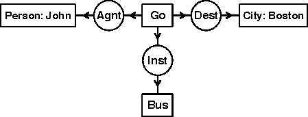
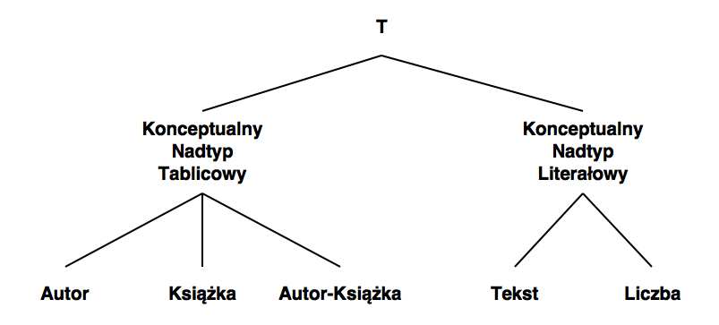
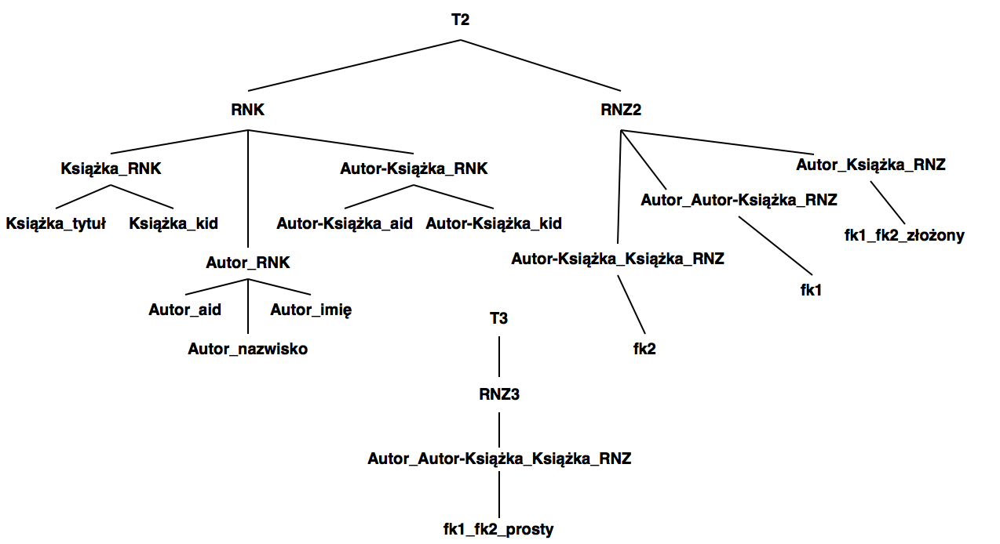
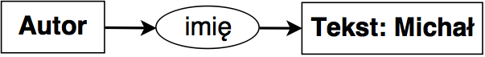
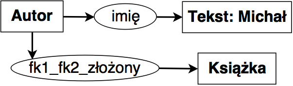
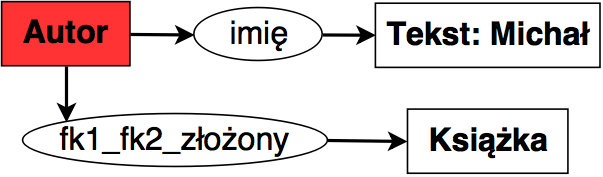
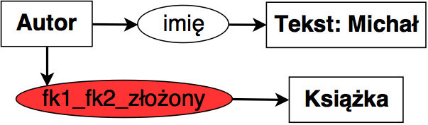
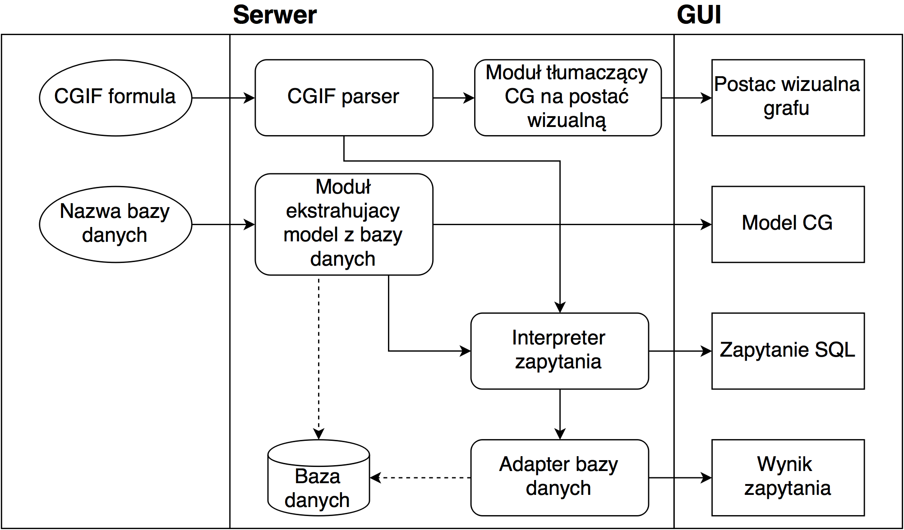
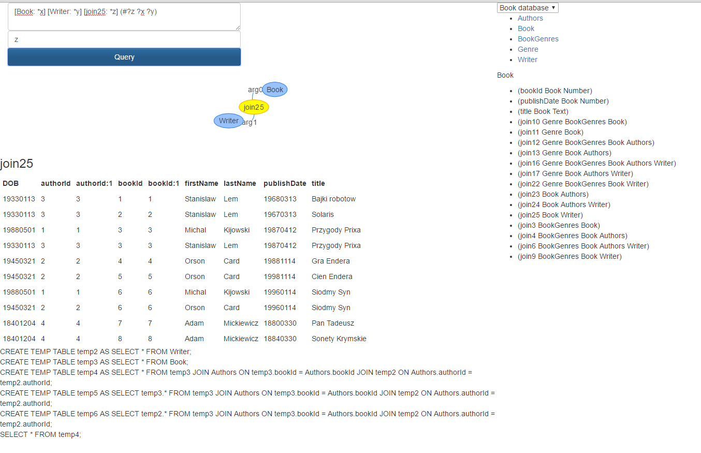
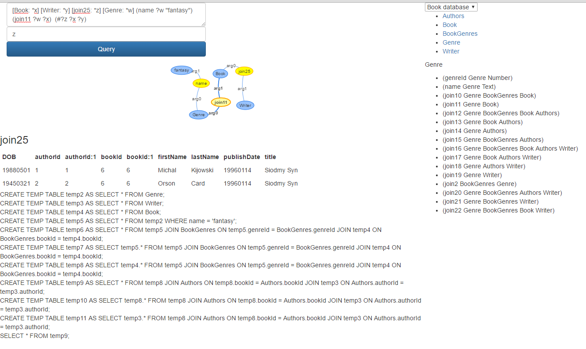

- title : Implementacja systemu służącego do zadawania zapytań w postaci grafów pojęć
- description : Introduction to FsReveal
- author : Michał Kijowski
- theme : black
- transition : default

***

#### Implementacja systemu służącego do zadawania zapytań w postaci grafów pojęć

***

### Motywacja i zagadnienia badawcze

' Głównym celem mojej pracy magisterskiej jest utworzenie programu umożliwiającego zadawanie zapytań do relacyjnych baz danych w postaci grafów konceptualnych.
' W ramach pracy sformułowałem dwa główne zagadnienia badawcze:

--- 
Modelowanie wiedzy zawartej w relacyjnej bazie danych przy pomocy grafów konceptualnych

--- 
Zadawanie zapytań do relacyjnej bazy danych przy użyciu tak powstałego modelu konceptualnego

***

### Grafy konceptualne
' Wprowadzając pojęcie grafu konceptualnego dobrze jest posłużyć się przykładem

---

Klasyczny przykład grafu konceptualnego reprezentujący wiedzę zawartą w zdaniu _John is going to Boston by bus_.
' Graf konceptualny w postaci wizualnej (_Display form_)

---

#### Podstawowe fakty dotyczące grafów konceptualnych

- 
Modelowanie wiedzy o świecie

- 
Obserwacja świata oparta na dostrzeganiu faktów dotyczących istnienia obiektów

- 
 Graf konceptualny składa się z wierzchołków dwóch rodzajów:

  * 
**Konceptów**, czyli  wierzchołków opisujących byty

  * 
**Relacji**, czyli wierzchołków opisujących zależności pomiędzy bytami

' Dokonując emp. obserwacji niemożliwe jest dostrzeżenie nieistnienia, alternatywy lub stwierdzenia, iż coś jest we wszystkich przyp. 
' Wynika z tego, że u ich podstawy stoją kwant. egzystencjalny oraz op. koniunkcji. 
' Każda relacja jest połączona krawędziami skierowanymi z wierzchołkami konceptualnymi wchodzącymi w skład danej relacji.
' Koncepty oraz relacje nazywane są wspólnie pojęciami.
' Z technicznego punktu widzenia CG jest grafem dwudzielnym skierowanym

---

' konkretnych byt typu Osoba o id John oraz bytu typu Miasto o id Boston
' niesprecyzowanych bytów typu Autobus oraz typu Iść
' relacja mówiąca o tym, że John jest Wykonawcą konceptu Iść
' relacja mówiąca o tym, że Autobus jest Narzędziem konceptu Iść
' relacja mówiąca o tym, że Boston jest Celem konceptu Iść

---

### CGIF

Formatem najczęsciej używanym do komunikacji pomiędzy programami wykorzystującymi grafy konceptualne jest format o nazwie **Conceptual Graph Interchange Format**.

    Core CGIF:
    [*x] [*y]
    (Go ?x) (Person John) (City Boston) (Bus ?y)
    (Agnt ?x John) (Dest ?x Boston) (Inst ?x ?y)

    Extended CGIF:
    [Go: *x] [Person: John *y] [City: Boston *z] [Bus: *w]
    (Agnt ?x ?y) (Dest ?x ?z) (Inst ?x ?z)

' Przydatną cechą grafów konceptualnych jest mnogość sposobów ich zapisu.
' _Postać graficzna_ jest formatem najbardziej przyjaznym dla czytelnika. Jednakże, istnieje również kilka zapisów liniowych, które są dużo przyjaźniejsze dla programów komputerowych pracujących z grafami.
' W ramach formatu CGIF koncepty ujętę są w nawiasy kwadratowe, natomiast relacje - zwykłe nawiasy. Symbole postaci \*x nazywane są etykietami definiującymi, natomiast symbole postaci ?y - etykietami związanymi. Dzięki temu możliwa jest łatwa prezentacja krawędzi grafu.

---

### Model grafu konceptualnego

Modelem nazywamy krotkę postaci $ M = ((T_C, \le_C), (T_R, \le_R), I) $ gdzie:

* zbiór $T_C$ nazywamy zbiorem typów konceptów, a relację częściowego porządku $\le_C$ - hierarchią konceptów.
* zbiór $T_R$ nazywamy zbiorem typów relacji, a relację częściowego porządku $\le_R$ - hierarchią relacji.
* zbiór $I$ nazywamy zbiorem indywiduów.

' W celu precyzyjnej definicji składni oraz semantyki grafu konceptualnego wprowadza się pojęcie **modelu** (zwanego czasami **słownikiem** lub **wsparciem**), który pozwala opisać syntaktyczne ograniczenia występujące pomiędzy pojęciami oraz dostarcza informacji na temat dziedziny, którą opisuje rozpatrywany graf.
' Nadtyp, podtyp, ---typ właściwy
' typ uniwersalny, typ absurdalny
' Należy podkreślić, że w ramach relacji częściowego porządku na typach konceptów nie definiujemy relacji równoważności pomiędzy konceptami.
' Zbiór typów konceptów wraz z hierarchią $(T_C, \le_C)$ jest kratą.
' Rózna arność relacji
' Skończony zbiór $I$ składający się ze stałych wyrażeń nazywamy zbiorem indywiduów. Każdy element tego zbioru jest reprezentacją konkretnego obiektu należącego do rozpatrywanego uniwersum. Dodatkowo istnieje element $*$ nazywany indywiduum uniwersalnym. Wówczas zbiór $M=I\cup \{*\}$ jest uporządkowany w sposób następujący: element $*$ jest większy niż każdy z elementów należących do $I$, natomiast każde dwa elementy $x,y\in I$ są nieporównywalne.

***

### Model relacyjny

---

Teoretyczną podstawą modelu relacyjnego jest matematyczna teoria mnogości.

Podstawowym pojęciem w modelu relacyjnym jest pojęcie **relacji**, za pomocą którego opisujemy zbiór rekordów (obiektów) o identycznej strukturze wewnętrznej. Obiekty te często przedstawia się w postaci tablicy.

Ustalony zbiór relacji nazywamy **schematem bazy danych**.

' Model relacyjny jest to model organizacji danych zaprezentowany po raz pierwszy w 1970 roku przez Edgara Frank Codda w pracy pt. _A Relational Model of Data for Large Shared Data Banks_

---

W modelu relacyjnym każda z relacji (prezentowana w postaci np. tabeli) jest reprezentowana za pomocą trzech parametrów:

* **Nazwa** - opisuje danę relację, musi być unikalna w ramach schematu bazy danych.
* **Nagłówek** - zbiór artybutów opisujących rekordy wchodzące w skład relacji. Pojedynczy atrybut jest parą składającą się z nazwy oraz typu danego atrybutu.
* **Zawartość** - zbiór krotek, gdzie pojedyncza krotka opisuje zależności pomiędzy danymi powiązanymi z poszczególnymi atrybutami.

---

### ALgebra relacyjna

Kolejnym ważnym elementem modelu relacyjnego jest zbiór operacji służących do manipulacji oraz przeszukiwania danych. Najczęściej zbiór tych operacji opisuje się przy pomocy **algebry relacyjnej**.

***

### Analogie pomiędzy grafami konceptualnymi a modelem relacyjnym

---

Zarówno model relacyjny jak i grafy konceptualne:

* 
Mogą być wykorzystywane do modelowania wiedzy o świecie.

* 
Posiadają podstawowe, niepodzielne jednostki wiedzy.

* 
Grupują wspomniane jednostki wiedzy poprzez nakładanie warunków na ich strukturę wewnętrzną.

* 
Umożliwiają wykonywanie szeregu operacji mających na celu manipulacje danymi.

' Przed przystąpieniem do głębszej analizy należy spojrzeć na model relacyjny oraz grafy konceptualne z szerszej perspektywy co pozwoli zaobserwować szereg analogii istniejących pomiędzy nimi.

***

### Generowanie modelu grafów konceptualnych ze schematu relacyjnej bazy danych

' W ramach niniejszej pracy magisterskiej wprowadziłem szereg pojęć rozszerzających teorię grafów konceptualnych. Pojęcia te są bezpośrednio powiązane z modelem relacyjnym, i umożliwiają one łatwiejszy opis opracowanej przeze mnie metody.

--- 
#### Typy Konceptualne

---

<b>Konceptualny Typ Tablicowy</b>   modeluje obiekty opisane przez krotki danej relacji
  

<b>Konceptualny Nadtyp Tablicowy</b>   wspólny nadtyp typów tablicowych
 

<b>Konceptualny Typ Liczbowy</b>   modeluje literały opisujące liczby
 

<b>Konceptualny Typ Napisowy</b>   modeluje literały opisujące napisy
 

<b>Konceptualny Nadtyp Literałowy</b>   wspólny nadtyp typów literałowych

' Przyjmijmy, że $r$ jest instancją schematu relacji $R=\{A_1,\ldots,A_n\}$. Dodatkowo niech $r$ składa się ze skończonego zbioru krotek oznaczonego przez $k$. 
' Wówczas możemy stworzyć **Konceptualny Typ Tablicowy** $T$ o następujących własnościach:
' * Typ $T_r$ modeluje ten sam typ obiektów co relacja $r$.
' * Z typem $T_r$ powiązany jest zbiór indywiduów wyznaczony przez zbiór obiektów $k$ tzn. każdy obiekt z $k$ ma typ $T_r$.
' **Konceptualnym Nadtypem Tablicowym** nazywamy specjalny typ wchodzący w skład zbioru typów konceptualnych wyekstrahowanych z danej bazy danych, który posiada następujące właściwości:
' * Dla każdego typu konceptualnego wchodzącego w skład hierarchii konceptów zachodzi następujący warunek - typ konceptualny $T$ jest podtypem Konceptualnego **Nadtypu Tablicowego** wtedy i tylko wtedy, gdy typ $T$ jest Konceptualnym Typem Tablicowym wyekstrahowanym z relacji wchodzącej w skład bazy danych.
' **Konceptualnym Nadtypem Literałowym** nazywamy specjalny typ $L$ wchodzący w skład zbioru typów konceptualnych wyekstrahowanych z danej bazy danych, który jest nadtypem **Konceptualnego Typu Liczbowego** oraz **Konceptualnego Typu Napisowego**.

---

--- 
#### Typy Relacyjne

---

<b>Relacyjny Typ Kolumnowy</b>   modeluje związek krotki z wartością danego atrybutu
  

<b>Relacyjny Nadtyp Kolumnowo-Tablicowy</b>   wspólny nadtyp typów kolumnowych danej relacji
 

<b>Relacyjny Nadtyp Kolumnowy</b>   wspólny nadtyp nadtypów kolumnowo-tablicowych
 

<b>Relacyjny Prosty Typ Złączeniowy</b>   modeluje związek opisany przez złączenie dwóch tabel
 

<b>Relacyjny Złożony Typ Złączeniowy</b>   modeluje związek opisany przez złączenie wielu tabel

' ###Relacyjny Typ Kolumnowy
' Przyjmijmy, że $r$ jest instancją schematu relacji $R=\{A_1,\ldots,A_n\}$. Dodatkowo niech $r$ składa się ze skończonego zbioru krotek oznaczonego przez $k$.
' Wówczas z relacji $r$ możemy wyekstrahować zbiór Relacyjnych Typów Kolumnowych $T_a = \{t_1,\ldots,t_n\}$ o następujących własnościach:

' * Typ relacyjny $t_i$ modeluje $i$-ty atrybut relacji $r$.
' * Typ relacyjny $t_i$ posiada sygnaturę postaci $t_i(K_r,L_i)$ gdzie $K_r$ jest Konceptualnym Typem Tablicowym wyekstrahowanym z relacji $r$, natomiast $L_i$ jest wyróżnionym typem literałowym  wyznaczonym przez domenę atrybutu $A_i$.

' ###Relacyjny Nadtyp Kolumnowo-Tablicowy
' Relacyjnym Nadtypem Kolumnowo-Tablicowym powiązanym z relacją $r$ nazywamy specjalny typ relacyjny $RNK_r$ o sygnaturze $RNK_r(K_r,L)$ o następujących własnościach:

' * $K_r$ jest Konceptualnym Typem Tablicowym wyekstrahowanym z relacji $r$.
' * $L$ jest Konceptualnym Nadtypem Literałowym.
' * Każdy Relacyjny Typ Kolumnowy $R_i$ wyekstrahowany z relacji $r$ jest podtypem typu $RNK_r$.

' ###Relacyjny Nadtyp Kolumnowy
' Relacyjnym Nadtypem Kolumnowym nazywamy specjalny typ relacyjny $RNK$ o sygnaturze $RNK(K,L)$ o następujących własnościach

' * $K$ jest Konceptualnym Nadtypem Tablicowym.
' * $L$ jest Konceptualnym Nadtypem Literałowym.
' * Każdy Relacyjny Nadtyp Kolumnowo-Tablicowy $RNK_r$ jest podtypem typu $RNK_r$.

' ###Relacyjny Prosty Typ Złączeniowy
' Przyjmijmy, że $r$ jest instancją schematu relacji $R=\{A_1,\ldots,A_n\}$ oraz $s$ jest instancją schematu relacji $S=\{B_1,\ldots,B_m\}$. Dodatkowo niech $fk=(C_1,\ldots,C_i)$ będzie kluczem obcym łączącym $R$ oraz $S$ tzn. $\forall_{j:1\leq j \leq i} \exists_{l:1\leq l\leq n} A_l=C_j $ oraz $\forall_{j: 1\leq j \leq i} \exists_{l: 1\leq l\leq m} B_l=C_j $.
' Wówczas Relacyjnym Prostym Typem Złączeniowym $T$ nazywamy typ relacyjny o następujących własnościach:

' Typ relacyjny $T$ modeluje obiekty należące do $r$ oraz $s$ będące w relacji $fk$.

' Typ relacyjny $T$ posiada sygnaturę postaci $T(K_r,K_s)$ gdzie $K_r$ jest Konceptualnym Typem Tablicowym wyekstrahowanym z relacji $r$, natomiast $K_s$ jest konceptualnym typem tablicowym wyekstrahowanym z relacji $s$.

' ###Relacyjny Złożony Typ Złączeniowy

' Przyjmijmy, że $R=\{r_1\ldots r_i\}$ jest zbiorem instancji schematów relacji $T_R=\{R_1\ldots R_i\}$, oraz $FK=\{fk_1\ldots fk_{i-1}\}$ jest zbiorem relacyjnych typów złączeniowych gdzie $\forall k fk_k=(r_k, r_{k+1})$, czyli $fk_k$ odpowiada złączeniu relacji $r_k$ oraz $r_{k+1}$.

' Możemy wówczas wyróżnić zbiór $X=\{x_1,\ldots,x_i\}$ gdzie $x_j$ jest przecięciem obiektów należących do $r_j$ będących jednocześnie w relacji $fk_j$ oraz $fk_{j+1}$.

' Wówczas dla każdego podziału ciągu $(1,\ldots,i)$ na trzy podciągi $(1,\ldots,a),(a+1,\ldots,b),(b+1,\ldots,i)$, takiego że $1\leq a\leq b\leq i-1$ możemy zdefiniować Złożony Typ Złączeniowy $Z$ o następujących własnościach:

' Typ relacyjny $Z$ modeluje obiekty należące do $\{x_1,\ldots,x_a,x_{b+1},\ldots,x_i\}$.

' Typ relacyjny $Z$ posiada sygnaturę postaci $T(K_1,\ldots,K_a,K_{b+1},\ldots,K_i)$ gdzie $K_i$ jest Konceptualnym Typem Tablicowym wyekstrahowanym z relacji $r_i$

' Z typem relacyjnym $Z$ związany jest zbiór argumentów ukrytych postaci $(K_{a+1},\ldots,K_{b})$ gdzie $K_i$ jest Konceptualnym Typem Tablicowym wyekstrahowanym z relacji $r_i$

---

---
### Opis algorytmu

Niech $r$ będzie bazą danych o schemacie $\mathbb{R}=(R_1,\ldots,R_n)$ gdzie $R_i$ jest schematem $i$-tej relacji. Wówczas algorytm tłumaczący schemat $\mathbb{R}$ na model grafu konceptualnego składa się z następujących kroków:

---

Inicjalizowane są puste zbiory $C$, $R$ oraz $I$, gdzie $C$ jest zbiorem typów konceptualnych, $R$ jest zbiorem typów relacyjnych, natomiast $I$ jest zbiorem indywiduów.

---
Dla każdej relacji $r_i\in r$ o schemacie $R_i(A_1,\ldots,A_k) $:

* Do zbioru $C$ dodawany jest Konceptualny Typ Tablicowy utworzony z $R_i$ zgodnie z definicją.
* Do zbioru $I$ dodawane są obiekty powstałe z kluczy głównych krotek z $r_i$.
* Dla każdego atrybutu $A_j, j\in 1,\ldots,k$:
  * Do zbioru $R$ dodawany jest Relacyjny Typ Kolumnowy utworzony z $R_i$ oraz $A_j$ zgodnie z definicją.
* Dla każdego klucza obcego $fk$ zdefiniowanego w ramach $R_i$:
  * Do zbioru $R$ dodawany jest Relacyjny Prosty Typ Złączeniowy utworzony z $R_i$ oraz tabeli wskazanej przez $fk$.

---

Tworzony jest graf $G=(V,E)$ gdzie $V$ jest zbiorem wierzchołków odpowiadających {Konceptualnym Typom Tablicowym należącym do $C$, natomiast $E$ jest zbiorem krawędzi odpowiadających {Relacyjnym Prostym Typom Złączeniowym należącym do $R$.

---

Dla każdej pary wierzchołków $v_i,v_j\in V$:

* Tworzony jest zbiór $P=(p_1,\ldots,p_m)$ złożony ze wszystkich ścieżek pomiędzy $v_i$ oraz $v_j$ w grafie $G$.
* Dla każdej ścieżki $p_i$ tworzony jest zbiór Relacyjnych Złożonych Typów Złączeniowych zgodnie z definicją.
* Do zbioru $R$ dodawane są typy uzyskane w poprzednim kroku.

---

Zbiory $C$ oraz $R$ uzupełniane są typami literałowymi oraz  nadtypami konceptualnymi opisanymi w ramach niniejszej pracy, jednocześnie budując relacje częściowego porządku $\leq_C$ oraz $\leq_R$ na tych zbiorach zgodnie z definicjami.

---
Zbiór $I$ uzupełniany jest o klasy odpowiadające literałom.

---
Zwracany jest model grafu konceptualnego postaci $M=((C,\leq_C),(R,\leq_R),I)$

***

### Zadawanie zapytania do relacyjnej bazy danych przy pomocy Konceptualnego grafu zapytania

---

Przed przystąpieniem do definicji **Konceptualnego Grafu Zapytania** należy zrozumieć, dlaczego normalny graf konceptualny nie jest wystarczający w przypadku zadawania zapytania.

---

---

---

### Konceptualny Graf Zapytania
Konceptualnym Grafem Zapytania nazywamy krotkę postaci $(G,Q)$, gdzie $G$ jest grafem konceptualnym, natomiast $Q$ jest zbiorem złożonym z wyróżnionych wierzchołków konceptualnych oraz relacyjnych należących do $G$.

' ### Zbiór wyników
' Niech $(G,Q)$ będzie Konceptualnym Grafem Zapytania opartym o model $M=((C,\leq_C),(R,\leq_R),I)$ wyekstrahowanym z relacyjnej bazy danych. Wówczas dla każdego $q \in Q$ **Zbiorem Wyników** $R_q$ nazywamy zbiór elementów z $I$ spełniających jeden z następujących warunków:

' Jeśli $q$ jest wierzchołkiem konceptualnym o typie $T_q\in C$, to wówczas $R_q$ składa się z obiektów typu $T_q$, które są zgodne z grafem $G$ tzn. spełniają wszystkie relacje opisane przez $G$.

' Jeśli $q$ jest wierzchołkiem relacyjnym o typie z sygnaturą $T_q(A_1,\ldots,A_n)\in R$ to wówczas $R_q$ składa się z obiektów typu koniunkcyjnego $T_q=A_1\wedge \ldots \wedge A_n$. Obiekty należące do $R_q$ są zgodne z grafem $G$ tzn. spełniają wszystkie relacje opisane przez $G$.

---

| Imię          | Nazwisko    |
| ------------- | ----------- |
| Michał        | Kijowski    |
| Michał        | Kwiatkowski |

---

| Imię          | Nazwisko    | Tytuł            | ISBN |
| ------------- | ----------- | ---------------- | ---- |
| Michał        | Kijowski    | Pierwsza książka | 1234 |
| Michał        | Kijowski    | Druga książka    | 5678 |
| Michał        | Kwiatkowski | Pierwsza książka | 1234 |

---
### Opis algorytmu

Główna idea algorytmu opiera się na rekurencyjnym zawężaniu zbiorów obiektów zgodnych z danym Konceptualnym Grafem Zapytania.

Mamy dany model konceptualny $M=((T_C, \leq_{C}),(T_R, \leq_{R}),I)$ oraz oparty na tym modelu Konceptualny Graf Zapytania $(G,Q)$, gdzie $G=(C,R,E,lab,coref)$ oraz $Q=(q_1,\ldots,q_n)$. Wówczas opisywany algorytm wykonuje następujące kroki:

---

Dla każdego wierzchołka konceptualnego $c\in C$ o Konceptualnym Typie Tablicowym $T_c$:

* Inicjalizowany jest zbiór $I_c$ zawierający obiekty z $I$ o typie $T_c$.

---

Dla każdego wierzchołka relacyjnego $r \in R$ o Relacyjnym Typie Kolumnowym:

* Niech $c$ oznacza wierzchołek będący argumentem $r$ o Konceptualnym Typie Tablicowym.
* Ze zbioru $I_c$ elementów powiązanych z wierzchołkiem $c$ usuwane są elementy, które nie spełniają relacji opisanej przez $r$.

---

Dla każdego wierzchołka relacyjnego $r\in R$ posiadającego Relacyjny Typ Złączeniowy:

* Dla każdego argumentu relacji $r$ postaci $c_i$:
  * Zbiór $I_i$ elementów powiązanych z wierzchołkiem $c_i$ ograniczany jest wyłącznie do elementów, które spełniają relację $r$.

---

Dla każdego wierzchołka konceptualnego $c\in Q$ o Konceptualnym Typie Tablicowym:

* Inicjalizowany jest zbiór $W_c$ równy zbiorowi $I_c$.

---

Dla każdego wierzchołka relacyjnego $r \in Q$ o Relacyjnym Typie Kolumnowym:

* Niech $c$ oznacza wierzchołek będący argumentem $r$ o Konceptualnym Typie Złączeniowym.
* Inicjalizowany jest zbiór $W_r$ równy zbiorowi $I_c$ elementów powiązanych z wierzchołkiem $c$.

---

Dla każdego wierzchołka relacyjnego $r\in Q$ posiadającego Relacyjny Typ Złączeniowy:

* Niech $c_1,\ldots,c_j,c_k,\ldots,c_n$ będą wierzchołkami będącymi argumentami relacji $r$.
* Inicjalizowany jest zbiór $W_r$ złożony z obiektów postaci $a=(a_1,\ldots,a_j,a_K,\ldots,a_n)$ gdzie $a_i\in I_i$ takich, że $a$ spełnia relacje $r$.

---

Zwracany jest zbiór Zbiorów Wyników $W=\{W_i | i\in Q\}$

***

### Konlator

---

---

---

***

Dziękuję za uwagę!
